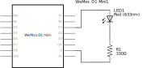
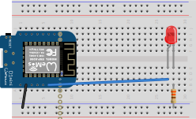

# Lab Exercise - ESP8266 Blink

This is a refresher exercise to reaquaint students with basic microcontroller usage.

## Exercise 1

#### Components Needed

* LED
* 330 ohm resistor
* connecting wires
* breadboard
* esp8266 development board (e.g. Wemos D1 mini)

### Instructions

1. Wire up the components as shown in the diagrams.

 

2. Open the led-blink sketch and run it. Does the LED blink?

 

## Exercise 2

1. Expand on the previous exercise. Add a yellow and a green LED to the circuit.

2. Rewrite the blink sketch to make the LEDs act like traffic lights.

3. Push your working traffic light code back to GitHub.
